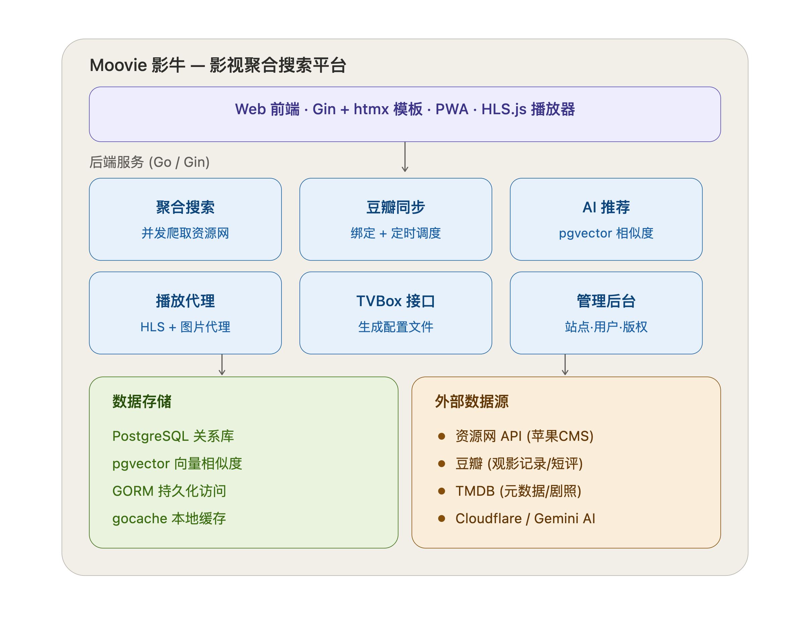

# 🎬 Moovie影牛

> **搜全网，只为你想看的那一部。**

Moovie 是一款基于 **Golang** 开发的聚合影视搜索工具。它通过整合多源搜索、智能推荐和极致的响应式设计，为你提供一个干净、高效的观影入口。

示例链接：[Moovie影牛 - 发现你的下一部电影](https://moovie.c2v2.com/)



---

## 🚀 特性亮点

- 🔍 **多源聚合搜索**：一键横跨多个影视资源站点，告别碎片化搜索。
- 🧠 **智能推荐 (AI Powered)**：基于 `pgvector` 矢量相似度算法，根据你的观影历史精准推荐。
- 📱 **PWA 支持**：原生级别的移动端体验，可添加到主屏幕，支持离线图标。
- 📺 **流畅播放**：内置 HLS.js 播放器，支持 m3u8 高清流媒体播放。
- 📝 **观影记忆**：自动同步 LocalStorage 到云端，多端进度无缝覆盖。
- ⚡ **极致速度**：基于 Gin + htmx，实现无刷新页面更新，响应迅速。
- 🔐 **安全可靠**：JWT + HttpOnly Cookie 认证，保障隐私安全。

---

## 🛠️ 技术栈

| 领域 | 技术方案 |
| :--- | :--- |
| **语言** | Go (Golang) 1.21+ |
| **Web 框架** | [Gin](https://github.com/gin-gonic/gin) |
| **数据库** | [PostgreSQL](https://www.postgresql.org/) + [pgvector](https://github.com/pgvector/pgvector) |
| **前端交互** | [htmx](https://htmx.org/) (High Power Tools for HTML) |
| **前端样式** | Vanilla CSS (Glassmorphism Design) |
| **播放器** | [hls.js](https://github.com/video-dev/hls.js/) |
| **缓存** | gocache (Local Memory Cache) |

---

## 📦 快速开始

### 环境依赖

- **Go**: v1.21 或更高版本
- **PostgreSQL**: v15+ (需安装 `pgvector` 扩展)

### 本地运行

1. **克隆仓储**
   ```bash
   git clone https://github.com/TwoThreeWang/Moovie.git
   cd Moovie
   ```

2. **环境配置**
   ```bash
   cp .env.example .env
   # 请在 .env 中配置你的数据库连接信息
   ```

3. **安装依赖并启动**
   ```bash
   go mod tidy
   go run ./cmd/server
   ```
   🚀 访问 [http://localhost:5007](http://localhost:5007)

### Docker 快捷部署

> [!IMPORTANT]
> 本项目的 `docker-compose.yml` 配置为使用名为 `postgres_default` 的**外部网络**。在启动之前，请确保你已经有一个正在运行的 PostgreSQL 容器，并且它连接到了该网络。

```bash
docker-compose up -d
```

> `docker-compose.yml` 已通过 `env_file` 读取 `.env`，新增配置项无需改动编排文件。

---

## ⚙️ 采集健康度与熔断

系统会自动记录每个采集站点的调用结果，按「站点 + 小时」分桶存入 `site_stats` 表（保留 7 天），在**后台 → 资源网**列表中可直接查看近 24 小时的成功率、空返回率与平均耗时。

统计分为四态，其中**空返回**单独拎出来是关键：采集站改了字段名时，HTTP 仍是 200、JSON 也能正常解析，只看成功率完全发现不了这种静默失效，只有空返回率会飙高。

连续 3 次超时或错误的站点会被暂时移出搜索候选（冷却 5 分钟，期间放探针试探恢复），避免每次搜索都在挂掉的站上白等一个超时。若某站近 1 小时成功率低于 50% 或空返回率高于 90%，会自动在**后台 → 反馈**中生成一条「系统告警」。

| 环境变量 | 默认值 | 说明 |
| :--- | :--- | :--- |
| `SEARCH_BREAKER_ENABLED` | `true` | 熔断开关。设为 `false` 则只统计、不跳过任何站点 |
| `HTTP_WRITE_TIMEOUT_SECONDS` | `30` | HTTP 响应写超时，必须显著大于采集侧超时预算（单站 10s / 整轮 30s） |

> [!NOTE]
> 熔断只作用于搜索扇出（多站点并发，跳过一个不影响可用性），不会作用于播放详情请求 —— 那是用户点击某个具体站点链接后的定向请求，跳过会直接导致播放页打不开。此外，当全部站点都处于熔断状态时会自动兜底放行，宁可慢也不会出现"搜什么都没有"。

---

## 📂 目录结构

```text
moovie/
├── cmd/server/         # 🚀 程序入口点
├── internal/           # 核心业务逻辑
│   ├── handler/        # 🎮 HTTP 处理器 (API/Admin/View)
│   ├── model/          # 📦 数据模型与 Schema
│   ├── repository/     # 🗄️ 数据库操作 (DAL)
│   ├── service/        # ⚙️ 业务逻辑 (搜索/爬虫/推荐)
│   └── middleware/     # 🛡️ JWT/CORS/Auth 中间件
├── web/                # 前端资源
│   ├── static/         # 🎨 CSS/JS/Assets
│   └── templates/      # 🧬 Go HTML 模板 (Layouts/Partials)
└── ...
```

---

## 🛡️ 许可证

本项目采用 **MIT License**。详情请参阅 [LICENSE](LICENSE) 文件。

---

**由 [TwoThreeWang](https://github.com/TwoThreeWang) 倾情打造。**
