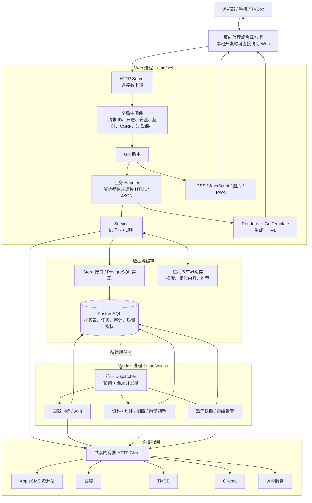
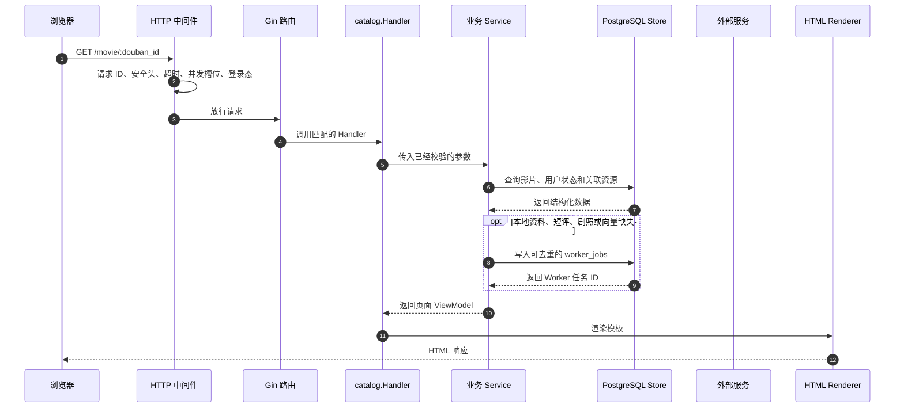
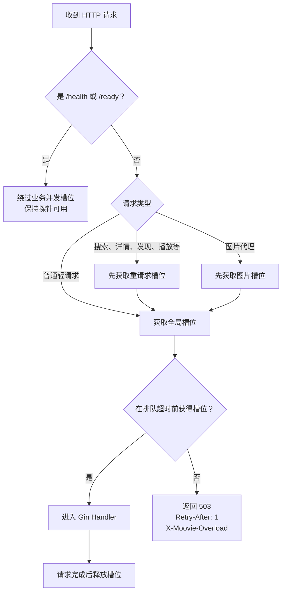

# Moovie New

`V4.0` 是 Moovie 的重构系统。它不是只替换页面样式，而是把搜索、影视资料、播放、用户、观影记录、社区和后台能力重新整理成一套可以独立运行、测试和发布的 Go Web 应用。Web 端使用 Gin、Go HTML Template、HTMX 和浏览器端 JavaScript；新系统上线后直接使用最终数据模型，不在运行时读取旧表、双写旧表或保留已废弃的客户端 API。

这份 README 主要写给第一次接触本项目、Go Web 或分层架构的开发者。建议先阅读“系统如何运行”和“推荐的代码阅读顺序”，再启动程序。

## 当前代码提供的能力

从 `cmd/web/main.go` 的路由装配和 `web/templates/pages` 的页面模板可以看到，当前实现包括：

- 公开页面：首页、统一搜索、趋势、发现、影视详情、播放、观看记录、推荐、相似内容、片场、用户公开片单、IPTV 和 TVBox。
- 用户能力：注册、登录、登出、设置、头像、想看/看过、短评、回复、点赞、播放进度同步和月度观影报告。
- 播放能力：HLS/M3U8、FLV、MP4、倍速、全屏、画中画、弹幕、手动换源，以及限定在同一媒体单元和同一集内的自动故障切换。
- 追剧更新时间：未完结剧集在详情页和播放页展示下一集播出日期，首页展示在看剧集的今日更新。
- 资料与推荐：豆瓣资料和短评、TMDB 剧照与季集、媒体身份和外部 ID、向量、相似内容、个性化推荐和热门快照。
- 管理与运维：资源站和过滤规则管理、媒体匹配复核、版权/分类管理、反馈处理、数据生命周期操作和 `/api/v2/admin/metrics` 指标接口。

这些是代码已提供的能力清单，不代表每项都已完成生产验收；生产准入仍按发布清单逐项留证。

## 先理解这个系统解决什么问题

Moovie 需要同时处理四类工作：

1. 接收浏览器或 TVBox 的请求，返回 HTML、JSON 或静态文件。
2. 从 PostgreSQL 读取用户、影视、资源、播放候选和任务数据。
3. 访问 AppleCMS、豆瓣、TMDB、Ollama、弹幕接口等外部服务。
4. 在后台执行同步、向量生成、热门快照和运维检查。

旧式实现容易把这些工作全部塞进一个 Web 进程。一旦大量用户同时进入，Web 请求、外部抓取和后台任务就会争抢 CPU、内存、网络连接和数据库连接，最终可能触发 OOM 或健康检查失败，导致容器反复重启。

新系统的核心改进是：

- Web 和 Worker 分离，用户请求不再与大部分后台任务运行在同一进程。
- 每类资源都有明确上限，例如 HTTP 在途请求、重请求、图片代理、数据库连接和外部主机连接。
- 媒体身份、资源站记录和播放候选分开保存，换源时不会把不同影片或不同剧集混在一起。
- 目录、片单和播放进度分别以 `media`、`user_movies`、`playback_positions` 为唯一运行时数据源，不保留双读、双写和废弃表。
- 突发负载检查和发布源码审计有独立工具；数据迁移已完成，仓库不再保留迁移和切流脚本。

## 初级开发者需要知道的名词

| 名词 | 在本项目中的含义 | 可以先看哪里 |
| --- | --- | --- |
| Route（路由） | URL 和处理函数的对应关系，例如 `GET /movie/:id` | 各模块的 `handler.go` 中的 `Register` |
| Handler（处理器） | 读取 HTTP 参数、调用业务逻辑、选择 HTML 或 JSON 响应 | `internal/*/handler.go` |
| Service（服务） | 执行业务规则，不负责页面排版 | `internal/*/service.go` |
| Store（存储接口） | 业务层需要的数据库能力约定 | `internal/*/store.go`、`ports.go` |
| Postgres Store | Store 的 PostgreSQL 实现 | `internal/*/postgres.go` |
| Renderer（渲染器） | 把 Go 数据交给模板，生成最终 HTML | `internal/platform/web`、`web/templates` |
| Middleware（中间件） | 在 Handler 前后统一处理日志、安全、超时、过载和登录态 | `internal/platform/httpserver` |
| Migration | 按版本顺序修改新数据库结构的 SQL 文件 | `internal/platform/database/migrations` |
| Worker | 不直接服务网页，专门执行后台任务的进程 | `cmd/worker` |
| Feature Flag | 控制少数高风险策略是否启用，例如资源匹配自动确认 | `.env.example` |

还需要区分六个容易混淆的数据概念：

- `media`：一部电影或剧集的统一身份，例如“同一部影片”。
- `media_units`：作品自身的一集，来自 TMDB 而不是任何资源站，携带官方播出日期 `air_date`。
- `vod_items`：某个资源站提供的一条资源记录，同一部影片可以对应多条资源。
- `resource_episode_candidates`：具体到某一季、某一集的可播放候选，用于排序和换源。
- `user_movies`：用户的想看、在看、看过和评分等片单状态。
- `playback_positions`：唯一的服务端播放进度表，既保存已关联媒体的进度，也允许少量只有资源站身份的记录。

统一身份负责回答“它是不是同一部作品”，剧集单元负责回答“这部剧有哪些集、各自什么时候播”，资源记录负责回答“哪个站提供了它”，剧集候选负责回答“这一集最终播放哪条线路”。`watch_histories`、`movies`、`resource_episodes` 等旧表已由 migration 0031 删除，现在只出现在 migration 文件的历史记录里，不属于新程序的业务运行结构。

## 整个系统如何运行

下面的流程图同时展示用户请求、后台任务、数据库和外部服务之间的关系。实线表示一次请求中的直接调用，虚线表示通过数据库或任务队列进行的异步协作。



### 一次普通页面请求会经过什么

以用户打开影视详情页为例，调用顺序大致如下：



初级开发者排查一个页面时，可以按照同一顺序找代码：

1. 在模块的 `handler.go` 找到路由。
2. 查看 Handler 读取了哪些路径参数、查询参数或表单字段。
3. 找到它调用的 Service 或 Store 方法。
4. 查看 `postgres.go` 中的 SQL，确认数据从哪里来。
5. 查看 `web/templates` 中对应页面或 partial，确认数据如何显示。
6. 如果页面还调用了接口，再检查 `web/static/js/app.js` 或 `player.js`。

### 后台任务为什么要单独运行

Web 只负责尽快完成用户请求。影视资料、豆瓣短评、TMDB 剧照、向量等需要较长时间或可能访问多个外部服务的工作先写入 PostgreSQL，再由 Worker 执行：

1. Web 收到豆瓣同步、资料刷新等请求。
2. Handler/Service 在数据库中创建或更新任务，马上返回任务状态。
3. Worker 定时扫描待处理任务。
4. Worker 调用豆瓣、TMDB 或 Ollama。
5. Worker 把结果、错误和更新时间写回 PostgreSQL。
6. 浏览器刷新或轮询状态时，从数据库读取最终结果。

管理员可在 `/admin/jobs` 查看统一队列并按状态筛选任务，列表使用任务 ID 游标分页，每页 50 条。运维任务每天分批清理终态记录：已完成保留 30 天、失败保留 90 天，统一任务表每轮最多删除 1,000 条；等待中和执行中的任务永不清理。同一个清理任务还负责观影历史同步账本 `history_sync_events`（保留 30 天，分块删）——删旧事件不会丢进度：进度本体在 `playback_positions`，账本只是游标流，被删掉的那条下次同步时由 `bootstrapSyncEvents` 自动补回来，所以账本会稳定在「保留期内的事件 + 每条存量进度一条」而不再无限增长。

生产 Compose 强制 Web 使用 `JOBS_IN_WEB=false`。不要为了“让任务马上跑”而临时让每个 Web 副本都启动 Dispatcher，否则扩容后同一类后台工作会与用户请求争抢资源。

## Web 进程的启动顺序

入口是 `cmd/web/main.go`。代码按 `── 阶段 N ──` 注释分段，启动顺序如下：

0. 解析 `.env`，再读取和校验完整配置。任一步失败都直接退出。
1. **模板**：编译所有 HTML 模板，缺模板直接报错退出。
2. **数据库连接 + Store 创建**：连接 PostgreSQL，按需执行 migration，用同一个连接池创建所有业务 Store。每个 Store 变量旁有注释说明它负责什么。
3. **进程级共享组件**：创建全局共享的外部 HTTP Client（资源站用、AI 用各一个）、搜索并发控制器、资源站熔断器和采集器。
4. **Service 层**：创建豆瓣/TMDB 数据提供者、搜索服务、播放详情、热门榜、元数据刷新链（豆瓣 → 短评 → 剧照 → 向量）等业务 Service。
5. **内嵌后台任务**（可选）：`JOBS_IN_WEB=true` 时在 Web 进程内启动 Worker Dispatcher，本地开发省得同时起两个进程。
6. **Handler 层**：创建各模块的 HTTP 处理器。代码中大量 `if xxx, ok := store.(SomeInterface)` 是在检查 Store 是否实现了某个可选能力——实现了就注入，没实现就安全降级。
7. **路由注册 + HTTP 服务启动**：集中注册所有路由，安装全局中间件，启动监听。
8. **等待退出信号**：主 goroutine 阻塞等 `SIGINT`/`SIGTERM`。
9. **优雅关闭**：按顺序关闭 HTTP 服务 → 后台搜索 → 熔断器 → Worker → 数据库 → HTTP Client，所有步骤共用同一个超时窗口，防止某一步卡住导致进程挂起。

## 目录和分层职责

```text
cmd/
  web/              Web 入口：装配依赖、注册路由、启动和关闭服务
  worker/           Worker 入口：启动统一任务 Dispatcher
  dbmigrate/        受控执行新库结构 migration，可停在指定版本
  burstcheck/       突发请求、受控 503 和健康隔离检查
internal/
  platform/         配置、数据库、HTTP、认证、出站访问、模板渲染、进程内缓存、按 IP 限流
  content/          首页、静态页面、robots 和 sitemap
  search/           资源站搜索、缓存、熔断、统一搜索和资源治理
  mediaidentity/    统一媒体身份、外部 ID、季集、播放候选和剧集播出日期
  mediatitle/       影视标题和资源标题规范化
  playback/         详情、播放、候选排序、质量事件和热门快照
  playurl/          播放地址和格式解析
  catalog/          豆瓣/TMDB 资料、剧集、剧照、向量和发现页
  recommendation/   相似内容和个性化推荐
  identity/         用户身份、登录态和权限
  history/          唯一播放进度模型、幂等同步、游标、墓碑记录和首页今日更新
  library/          想看、看过和用户影视状态
  douban/           豆瓣绑定、同步任务及其处理器
  doubanpopular/    豆瓣热门数据 Provider
  report/           月度观影报告和公开报告页
  social/           片场、短评、点赞和回复
  feedback/         用户反馈
  danmaku/          弹幕读取和发送
  admin/            后台管理页面、匹配复核和数据操作
  workqueue/        全站唯一的后台任务队列（worker_jobs）：入队、抢锁、租约、重试退避
  operations/       指标和运维检查
  compat/           页面 SEO 快照抓取与端点压测的共享实现，供测试和 burstcheck 使用
  contract/         最终路由和请求输入契约，防止废弃 API 回流
web/
  templates/        Go HTML 模板
  static/css/       全站样式
  static/js/        业务 JavaScript 与第三方浏览器库
scripts/release/    发布源码完整性审计脚本
docs/               发布清单、验收证据和高并发手册
```

分层时遵循以下原则：

- Handler 处理 HTTP，不把复杂 SQL 或匹配算法直接写在 Handler 中。
- Service 负责业务规则，通过小型接口依赖 Store 或外部 Provider。
- Store 负责持久化，不负责决定页面显示文案。
- `cmd/web` 和 `cmd/worker` 是依赖装配层，可以知道所有业务模块；业务模块之间尽量只通过接口协作。
- 模板只负责显示已经准备好的 ViewModel，不在模板中重新实现业务判断。

公开页面路径会尽量保持不变，以保护用户书签和 SEO；这不表示后端仍保留旧实现。浏览器页面只调用最终 API，`internal/contract` 会同时守住“应存在的正式路由”和“必须保持 404 的废弃路由”。

## 推荐的代码阅读顺序

第一次阅读不建议从最大的 SQL 文件或所有 Handler 开始。可以按下面顺序建立整体认识：

0. 先看目标包顶部的中文包说明（例如 `head -12 internal/search/service.go`），一句话知道它管什么、碰哪几张表。
1. `README.md`：理解系统边界、数据表分组和流程。
2. `.env.example`：知道系统有哪些可选能力和安全上限。
3. `cmd/web/main.go`：看所有模块如何被组装。
4. `internal/platform/httpserver/server.go`：看一条请求先经过哪些保护。
5. 选择一个业务模块，例如 `internal/search`，按 `handler.go → service.go → store.go → postgres.go` 阅读。
6. `web/templates/layouts/base.html` 和一个具体页面模板：理解 SSR 页面结构。
7. `web/static/js/app.js`、`player.js`：理解浏览器端增强和播放器行为。
8. `cmd/worker/main.go`：理解后台任务如何与 Web 分离。
9. `internal/platform/database/migrations`：最后再看数据库结构如何逐步演进。

查找某个 URL 的入口时可以使用：

```bash
rg -n 'router\.(GET|POST|PUT|PATCH|DELETE)' internal
rg -n '要查找的路径或字段名' cmd internal web
```

## 主要业务流程

### 搜索流程

1. Handler 校验关键词并先读取本地缓存或 PostgreSQL。
2. 如果需要查询上游，Service 从启用的资源站中选择健康来源。
3. Runner 按固定并发数访问 AppleCMS，每个来源还有自己的超时。
4. 熔断器记录成功、空结果、超时和失败，连续异常来源进入冷却。
5. 资源结果通过 `resource_media_links` 关联统一 `media` 身份；低置信度结果只进入待审核候选。
6. `RESOURCE_MATCH_SHADOW=true` 时只记录匹配证据，不自动确认新关联。
7. Handler 返回完整页面、统一 HTMX partial 或正式 JSON API。

搜索失败采用降级策略：单个资源站失败不会让整个页面变成 500；已有本地结果或其他成功来源仍可返回。

### 播放流程

1. `/play` 或 `/watch` 根据统一媒体身份、资源站和剧集键查找候选。两个入口分工不同，不能合并：`/play/:source_key/:vod_id` 直接拿资源站详情播，**不需要豆瓣关联**，服务的是关联不上元数据的资源；`/watch/:douban_id` 先定媒体再挑最优线路，能跨资源站自动选最好的。`/watch` 走不通（媒体查不到、或补录索引后仍无候选）而 URL 上又带了 `source_key`+`vod_id` 时，会降级成 `/play` 的资源直连方式渲染，不再把用户 302 回搜索页。
2. 后端先过滤到“同一部作品、同一季、同一集”，再根据成功率和速度排序。
3. 默认候选被解析成播放 URL，页面同时获得可手动选择的备选线路。
4. 浏览器中的 `player.js` 根据 HLS 等格式初始化播放器。
5. 播放成功、失败和加载耗时以受限频率上报，用于以后排序。
6. 后端会在规范播放响应中标记 `auto_failover_enabled=true`；前端最多自动尝试两次同一 `media_unit_id` 的候选，找不到同集候选时只展示可手动选择的线路，不会跨集切换。

最重要的安全规则是：某一集播放失败时，不能退回另一集，更不能默认回到第一集。`media_unit_id` 和规范化 `episode_key` 就是为了解决这个问题。

### 历史记录流程

- 未登录用户先把进度保存在浏览器 `localStorage`。
- 登录后，浏览器把本地记录按带 `operation_id` 的幂等请求同步到服务端。
- 服务端只写 `playback_positions`，「继续观看」、用户中心和同步接口也只读这张表，不再回退 `watch_histories`。
- 被标记「已看」的影片不出现在「继续观看」中，但 `playback_positions` 里的行会保留。物理删除会让误点变成不可恢复的数据丢失，也会让月报失去这段观看事实；取消「已看」后进度自动重新出现。
- 该排除条件要求「已看」标记不早于最后一次播放（`user_movies.updated_at >= playback_positions.activity_at`）。`user_movies` 中的 `watched` 有两个来源：用户手动点击写入当前时刻，豆瓣同步则原样写入豆瓣的标记时间。豆瓣只能整部标记、没有分集概念，「看过第一季」和「正在追第二季」在库里完全一样；不比较时间的话，一次豆瓣全量同步会把用户正在追的剧集从「继续观看」中抹掉。标记已看后重新播放时 `activity_at` 会超过 `updated_at`，影片重新回到列表——重看本来就该出现在这里。

### 追剧更新时间流程

追剧场景要回答的问题只有一个：我在追的这部剧，下一集什么时候更新。

- 播出日期来自 TMDB，存在 `media_units.air_date`（DATE 类型，不带时区）。
- 一次 `/3/tv/{id}` 详情请求同时返回连载状态 `status` 和 `next_episode_to_air`。后者直接给出下一集的集号与播出日期，因此不必逐季调用 season 接口就能拿到最关键的信息；`syncTVSeasons` 会先把它落库，再补齐整季数据。
- 连载状态存在 `media.series_status`，保存 TMDB 原值（`Returning Series` / `Ended` / `Canceled` 等）。判断是否还会更新一律使用 `mediaidentity.SeriesEnded`，不要直接比较字符串。
- 该判定是"白名单式完结"：只有明确的完结与砍剧状态才算完结，空值和未知的新状态都按"可能还会更新"处理。漏掉一次更新提醒，好过把在播剧错误地标成完结。
- `/play` 和 `/watch` 共用四个播放片段：`partials/play_container.html`（播放器 + 免责条）、`play_scripts.html`（播放器依赖库）、`play_comments.html`、`play_similar.html`。改播放器版本号只需要动 `play_scripts.html` 一处。两页的 `initPlayer` 配置**故意各写各的**：`episodes` 和 `vodName` 在两边含义不同。
- 详情页、`/play` 和 `/watch` 共用 `partials/air_schedule.html`。已完结、非剧集、以及 TMDB 尚未给出播出日期时，这个 partial 不渲染任何内容，包括外壳。
- 首页「今日更新」先从「继续观看」收敛出用户在看的 `media_id`，再按当天日期查 `media_units`。区块外壳同样全部放在 partial 内部，没有更新时端点返回空响应体，首页不会留下孤立标题。
- 「今天」按 `DB_TIMEZONE` 指定的时区判断，默认 `Asia/Shanghai`。`air_date` 是不带时区的 DATE，展示时只取年月日再按该时区重建，不做时区换算——否则 UTC 与东八区之间会整体差一天。

TMDB 对未定档集次经常返回 `null`，所有查询都排除 `air_date IS NULL` 的记录，避免把缺失日期渲染成 `0001-01-01` 这样的假数据。

### 资料与推荐流程

- 豆瓣负责主要中文资料和旧站兼容内容。
- TMDB 补充原始语言、时长、剧照、季集和 TMDB 评分。
- 字段级来源优先级决定哪个 Provider 可以更新哪个字段，避免后完成的任务覆盖更权威的数据。
- Ollama 生成 768 维向量，用于相似内容与个性化推荐。
- 推荐和相似内容使用有界缓存与 `singleflight`，避免热门详情页冷缓存时同时触发大量相同查询。

## 本地运行

本地功能验收使用直接 `go run`；Docker 镜像验证是另一个独立门禁。

### 1. 准备依赖

- Go `1.25.4`
- PostgreSQL `15+`
- `vector` 与 `pg_trgm` 扩展；migration 会尝试创建，数据库用户需要相应权限

TMDB、Ollama 和外部弹幕是当前入口实际接入的可选增强，未配置时对应能力会关闭或降级，不应影响基础页面启动。`.env.example` 中的 `CF_*` 变量目前只会被配置层解析；`cmd/web` 没有在当前装配流程中创建 Cloudflare AI Provider，单独设置这些变量不会自动开启新的后端 AI 调用。

### 2. 创建隔离数据库

新系统不得直接使用旧系统数据库，`DB_NAME=moovie` 会被直接拒绝启动。全新本地安装可以使用任意独立库名，例如 `moovie_new`；数据迁移流程的目标库则必须使用 `moovie_v2`。下面是本地 `psql` 示例，用户名和端口按实际环境修改：

```bash
psql -h 127.0.0.1 -U postgres -c 'CREATE DATABASE moovie_new;'
```

如果数据库已经存在，不要重复创建。可以先检查：

```bash
psql -h 127.0.0.1 -U postgres -l
```

### 3. 创建本地配置

```bash
cd new
cp .env.example .env
```

至少检查以下配置：

```dotenv
APP_ENV=development
PORT=5008
SITE_URL=http://localhost:5008

DB_AUTO_MIGRATE=true
DB_HOST=localhost
DB_PORT=5432
DB_USER=postgres
DB_PASSWORD=请替换为本地密码
DB_NAME=moovie_new
DB_MAX_CONNS=12

# 单进程快速 smoke test 可填 true；Web + Worker 或 Compose 使用 false
JOBS_IN_WEB=false
APP_SECRET=请替换为足够长的随机值
```

应用会先读取 `.env`，再让当前进程中已经导出的同名环境变量覆盖文件值。不要使用 `source .env`：`.env` 是应用配置文件，不保证每一行都符合 shell 语法。

### 4. 启动 Web

```bash
GOCACHE=/private/tmp/gocache go run ./cmd/web
```

**注意 `JOBS_IN_WEB` 的取值**，这是最容易踩的坑：

- `JOBS_IN_WEB=true`：Web 进程自己启动唯一的统一任务 Dispatcher，单进程就够，适合本地快速验证。
- `JOBS_IN_WEB=false`：Web 不启动统一 Dispatcher，**必须另外启动 `cmd/worker`**；否则豆瓣同步、资料/短评/剧照/向量刷新、热门快照和运维任务不会被独立进程执行。请求内的资源站搜索和播放详情访问仍可工作，不要把“页面能打开”误认为 Worker 已经运行。

端口被占用时会看到 `bind: address already in use`。用 `lsof -nP -iTCP:5008 -sTCP:LISTEN` 查出占用进程，或改用 `PORT=5009 go run ./cmd/web`（换端口时记得同步改 `SITE_URL`，否则分享链接和 sitemap 仍指向旧端口）。

默认访问 [http://localhost:5008](http://localhost:5008)。另开一个终端检查：

```bash
curl http://127.0.0.1:5008/health
curl http://127.0.0.1:5008/ready
```

- `/health` 只检查 Web 进程是否存活，不访问数据库，适合作为容器 liveness。
- `/ready` 会检查 PostgreSQL，适合负载均衡判断实例是否可以接流量。
- 数据库短暂拥塞时 `/ready` 可能失败，但不应因此自动重启仍然健康的进程。

首次 migration 完成后，日常开发可以改为 `DB_AUTO_MIGRATE=false`，减少误用 schema 权限的风险。

### 5. 按需启动 Worker

需要验证豆瓣同步、资料刷新、向量、热门快照或运维告警时，在另一个终端运行：

```bash
JOBS_IN_WEB=false GOCACHE=/private/tmp/gocache go run ./cmd/worker
```

只有 Web 侧 `JOBS_IN_WEB=false` 时才需要它。此时任务会保留为待处理状态，而不是由 Web 偷偷执行。

### 6. 停止服务

在各自终端按 `Ctrl+C`。Web 和 Worker 会收到 `SIGINT`，进入优雅关闭。不要直接长期遗留多个不同端口的 `go run` 进程，否则浏览器可能访问到旧实例，造成“代码已经修改但页面没有变化”的假象。

## 配置如何生效

完整配置见 [`.env.example`](.env.example)。主要分组如下：

| 分组 | 关键变量 | 作用 |
| --- | --- | --- |
| 应用 | `APP_ENV`、`PORT`、`SITE_URL`、`WEB_ROOT`、`APP_SECRET` | 运行环境、监听端口、模板目录和签名密钥 |
| 数据库 | `DB_AUTO_MIGRATE`、`DB_*` | 是否自动迁移、连接信息 |
| HTTP 预算 | `HTTP_MAX_*`、`HTTP_QUEUE_TIMEOUT_MILLISECONDS` | 控制并发、排队、请求体和连接数 |
| 日志 | `HTTP_ACCESS_LOG_SAMPLE_PERCENT`、`HTTP_ACCESS_LOG_MAX_PER_SECOND` | 防止访问日志在流量高峰放大资源占用 |
| 搜索 | `SEARCH_*`、`OUTBOUND_MAX_CONNS_PER_HOST` | 上游超时、来源并发、缓存和熔断 |
| 热门快照 | `POPULARITY_REFRESH_MINUTES` | 控制快照重算周期 |
| 外部服务 | `TMDB_API_TOKEN`、`OLLAMA_*`、`DANMU_API_BASE` | 当前已接入的可选 Provider；`CF_*` 仅由配置层保留和解析 |
| 任务 | `JOBS_IN_WEB`、`WORKER_POLL_SECONDS`、`WORKER_CONCURRENCY` | 控制执行位置、扫描周期和统一队列的全局并发槽数 |

生产环境会额外强制校验：

- `SITE_URL` 必须使用 HTTPS。
- `APP_SECRET` 至少 32 字节且不能保留示例值。
- HTTP、搜索、数据库和外部连接参数不能超过代码中的安全上限。

配置加载失败时，程序会在监听端口前退出。先看终端中的 `configuration failed` 及具体字段，不要只反复重启。

## 功能开关

统一搜索、历史 V2、播放候选排序、自动换源和热门快照均已固定启用，不再提供旧版切换开关。仍可调节的只有资源匹配策略：

1. `RESOURCE_MATCH_SHADOW=true` 时匹配候选只进影子表，不改动线上关联。
2. 观察影子表质量数据后，再决定是否开启 `RESOURCE_MATCH_AUTO_APPLY`。
3. `MEDIA_REVIEW_MATCH_THRESHOLD` 必须严格小于 `MEDIA_AUTO_MATCH_THRESHOLD`。

## 高并发保护是如何工作的

每个 Web 实例不是无限接收请求，而是先分类再获取信号量槽位：



为什么先拿“重请求槽位”，再拿“全局槽位”：如果顺序相反，大量重请求可能占满全部全局槽位，然后一起等待较小的重请求池，普通登录页或简单页面也会被拖住。

默认单个 Web 实例的边界：

| 资源 | 默认值 | 超过后会怎样 |
| --- | ---: | --- |
| HTTP 总在途请求 | 64 | 短暂排队，随后返回 503 |
| 重请求 | 12 | 只限制搜索、详情、发现、播放等高成本路径 |
| 图片代理 | 24 | 防止大量图片下载占满所有请求 |
| 过载排队 | 100ms | 到期主动降载，不让 goroutine 无限堆积 |
| TCP 连接 | 512 | Listener 不再接收更多连接 |
| Web / Worker PostgreSQL 连接 | 12 / 6 | pgx 池内等待，不无限创建连接 |
| 单个外部主机连接 | 12 | 复用共享 Client，限制套接字数量 |
| 单次搜索来源并发 | 6 | 其余来源等待或受总超时取消 |
| 搜索后台补全并发 | 8 | 无槽位时放弃可重试的非关键异步工作 |
| 搜索缓存 | 500 条 | 按 LRU 淘汰旧条目（`internal/platform/cache`，搜索、弹幕、相似推荐共用一份实现） |
| 个性化推荐快照 | 每用户 1 行 / 6 小时 | Web 只读 PostgreSQL 快照；缺失或过期时通过 Worker 去重刷新 |
| AppleCMS 单响应 | 4MiB | 超限响应被拒绝 |
| 生产成功访问日志 | 10%，最多 20 条/秒 | 错误和慢请求仍然记录 |

本地最终容量样本：热点详情页 20,000 请求、200 并发，传输错误 0、健康检查失败 0、P95 约 129ms；RSS 约 64MiB → 148MiB，并在停止负载后保持稳定。2026-08-12 又在最终迁移库上复验详情页 5,000 请求和规范播放页 3,000 请求，均为 200 并发、传输错误 0、健康检查失败 0、P95 分别约 127ms 和 134ms，过载请求按设计返回受控 503。该数据只证明保护机制和本机基线，不是生产 SLA。完整记录见 [`docs/LOCAL_HIGH_CONCURRENCY_ACCEPTANCE_2026-08-10.md`](docs/LOCAL_HIGH_CONCURRENCY_ACCEPTANCE_2026-08-10.md)。

持续发生 503 时，先确认是哪一种 `X-Moovie-Overload`，再考虑增加 Web 副本、边缘限流或缓存。不要第一时间把所有并发和数据库连接数调大，否则只是把压力推给 PostgreSQL 或外部服务。

生产诊断见 [`docs/HIGH_CONCURRENCY_RUNBOOK.md`](docs/HIGH_CONCURRENCY_RUNBOOK.md)。

## 数据库和 migration

### 全部 30 张业务表

除 `schema_migrations` 外，运行时一共 30 张表。按用途分成七组，同一组内的表通常在同一个模块里读写：

| 组 | 表 | 一句话说明 |
| --- | --- | --- |
| **账号与社区** | `users` | 账号本身 |
| | `user_movies` | 片单：想看 / 看过 / 评分 / 短评。短评没有独立的表，就是这张表上的 `comment` 字段 |
| | `comment_likes` | 短评点赞，挂在 `user_movie_id` 上 |
| | `comment_replies` | 短评回复，同样挂在 `user_movie_id` 上 |
| | `social_notifications` | 短评点赞与回复通知；点赞按短评聚合展示，支持未读状态与硬删除 |
| | `feedbacks` | 用户反馈 |
| | `monthly_reports` | 月度观影报告，每人每月一行，由定时任务算好存起来 |
| | `user_recommendation_snapshots` | 个性化推荐快照，每用户一行；过期先返回旧结果，再由 Worker 刷新 |
| **观看记录** | `playback_positions` | 唯一的服务端播放进度表 |
| | `history_sync_events` | 多设备同步的事件账本，只追加，客户端按游标增量拉取；保留 30 天，过期由每日清理删掉 |
| **影片身份** | `media` | 一部电影或剧集的统一身份，全站围绕它组织 |
| | `media_units` | 作品自己的一集（来自 TMDB），带官方播出日期 `air_date` |
| | `media_aliases` | 别名，用于搜索匹配 |
| | `media_external_ids` | 豆瓣 / TMDB / IMDb 等外部 ID |
| | `media_field_sources` | 每个字段当前由哪个来源提供，防止低优先级来源覆盖高优先级数据 |
| | `media_source_snapshots` | 每个来源最近一次抓取的状态：`payload_hash` 比对是否有变化、`unchanged_count` 连续未变次数、`changed_at` 最后一次真的变了是什么时候。`payload_json` 已不再写入真实内容 |
| **资源站** | `sites` | 已接入的 AppleCMS 资源站 |
| | `vod_items` | 某个资源站上的一条影片记录，同一部影片可以有多条 |
| | `resource_media_links` | 资源 ↔ 影片身份的已确认关联 |
| | `resource_match_candidates` | 机器拿不准的匹配，进后台等人工复核 |
| | `resource_play_lines` | 一条资源下的播放线路（不同线路速度不同） |
| | `resource_episode_candidates` | 具体到某一季某一集的可播放候选，换源就在这一层选 |
| | `site_stats` | 各资源站按时间桶的成功 / 空 / 超时 / 失败次数 |
| **播放质量与热度** | `playback_attempt_events` | 播放埋点原始事件 |
| | `popularity_snapshots` | 热门榜与本站热播快照；Web 只读当前未过期批次 |
| | `popularity_snapshot_runs` | 每次重算热门榜的记录 |
| **搜索与过滤** | `search_logs` | 搜索日志 |
| | `copyright_filters` | 版权屏蔽词，命中的影片不出现在搜索结果 |
| | `category_filters` | 分类屏蔽词，用于不收录某些资源分类 |
| **其他** | `danmakus` | 站内弹幕 |
| | `worker_jobs` | 全站唯一的后台任务队列，所有定时和异步任务都在这里 |

几条帮助理解的规则：

- **`media` 和 `vod_items` 是两件事。** `media` 回答"它是不是同一部作品"，`vod_items` 回答"哪个站提供了它"，中间靠 `resource_media_links` 连起来。这一层拆分是刻意的：不拆的话换源时会把不同影片或不同剧集混在一起。
- **豆瓣同步没有自己的表**，直接复用 `worker_jobs`，结果写进 `user_movies`。
- **短评没有自己的表**，它是 `user_movies.comment`；所以点赞和回复都挂在 `user_movie_id` 上。
- 表按功能分组后，`resource_*` 系列 7 张是最密集的一块，也是最值得优先审视的地方。

### migration 如何执行

系统内嵌 50 个按文件名排序的 migration。应用 migration 时会：

1. 打开一个数据库事务。
2. 获取 PostgreSQL advisory transaction lock，防止多个实例同时迁移。
3. 创建或读取 `schema_migrations`。
4. 跳过已经记录的版本。
5. 顺序执行剩余 SQL，并记录版本。
6. 全部成功后提交；任何一步失败都会回滚本次事务。

本地首次启动可以使用 `DB_AUTO_MIGRATE=true`。生产环境建议由受控发布步骤执行 migration，Web 和 Worker 日常运行使用 `DB_AUTO_MIGRATE=false`。

schema migration 由应用内嵌 SQL 完成（`internal/platform/database/migrations`），启动时按 `DB_AUTO_MIGRATE` 自动执行，只跑一次并记录在 `schema_migrations`。旧库到新库的一次性数据迁移已于 2026-08 完成，相关工具（`cmd/datamigrate`、`scripts/migrate.sh`、`cmd/releaseaudit`）已从仓库移除，需要时可从 Git 历史取回。

## 测试和验收工具

### 日常代码门禁

```bash
make check   # go test + go vet + go build
make race    # go test -race
```

等价命令：

```bash
GOCACHE=/private/tmp/gocache go test ./...
GOCACHE=/private/tmp/gocache go vet ./...
GOCACHE=/private/tmp/gocache go build ./...
GOCACHE=/private/tmp/gocache go test -race ./...
```

这些命令分别回答不同问题：

- `go test`：已有行为测试是否仍然通过。
- `go vet`：是否存在常见的 Go 静态问题。
- `go build`：所有包和命令能否编译。
- `go test -race`：并发测试过程中是否检测到数据竞争。

它们不能证明真实浏览器样式、外部 API、生产数据库或容器资源一定正常，因此不能跳过后续门禁。

### 专用验收命令

| 命令 | 作用 | 是否写数据 |
| --- | --- | --- |
| `cmd/burstcheck` | 验证突发请求、受控 503 和健康隔离 | 只发送读取请求 |
| `cmd/dbmigrate` | 应用目标库结构 migration | **是** |

查看参数：

```bash
go run ./cmd/burstcheck -h
```

页面 SEO 不再由独立命令对比，而是由 `internal/content` 和 `internal/search` 的回归测试直接断言：`compat.Fetch` 抓取渲染后的页面，逐项检查 Title、H1、Description、Keywords、Robots、Canonical、OG/Twitter 标签和 JSON-LD。这些断言随 `make check` 一起运行。

### 发布源码审计

[`scripts/release/source-audit.sh`](scripts/release/source-audit.sh) 检查发布产物是否完整：`go.mod`、`go.sum`、`Dockerfile`、`docker-compose.yml`、`.dockerignore`、`web/templates` 和 migration 目录缺任意一个都会失败。它不构建镜像，也不修改 Git 或业务数据。

## Docker Compose

本地功能调试不依赖 Docker。需要验证最终容器时：

1. 将 `.env` 改为生产有效值，例如 HTTPS `SITE_URL` 和 32 字节以上的 `APP_SECRET`。
2. 将 `DB_HOST` 设置为 `postgres_default` 网络中可解析的 PostgreSQL 服务名，不能写容器内部的 `localhost`。
3. 确认外部 Docker 网络 `postgres_default` 已存在。
4. 按 Web 和 Worker 副本数核算数据库连接总和。
5. 先渲染配置，再构建和启动。

```bash
docker compose config --quiet
docker compose up -d --build
docker compose ps
```

Compose 默认资源边界：

- Web：1GiB、`GOMEMLIMIT=700MiB`、2 CPU、12 条数据库连接。
- Worker：512MiB、`GOMEMLIMIT=320MiB`、1 CPU、6 条数据库连接。
- Web liveness 使用 `/health`，`/ready` 只供负载均衡判断。
- 两个容器均限制 PID 和日志大小，并使用只读根文件系统。

`docker compose config` 通过只表示 YAML 和变量可以渲染，不代表镜像已构建、容器已健康或生产同规格压测已通过。

### 使用 build.sh 更新服务器

服务器首次使用前需要确认：

1. `new/` 已纳入父仓库并提交，服务器能够通过 Git 拉取。
2. `new/.env` 已配置完成，且生产 `APP_SECRET` 与旧系统一致。
3. 外部网络 `postgres_default` 已存在。
4. 现有 WARP 容器已连接该网络，并能通过 `cloudflare-warp:1080` 提供 SOCKS5 代理；新 Worker 会使用它访问外部 HTTP 服务。

以后每次本地提交并推送后，在服务器执行：

```bash
cd /path/to/Moovie/new
./build.sh
```

脚本会从父仓库执行 `git pull --ff-only`，然后在 `new/` 中重新构建并强制重建 Web、Worker，最后输出容器状态。新服务默认映射到宿主机 `5008` 端口。

`build.sh` 不会执行数据库 migration、旧库数据迁移、备份、健康检查或流量切换；这些步骤仍需按照发布清单单独完成。如果 Git 无法快进、缺少 `new/.env`、镜像构建失败或容器启动失败，脚本会立即停止。

## 上线和回滚

推荐发布顺序：

1. 冻结发布版本并记录提交号。
2. 以受控步骤执行 `cmd/dbmigrate`，确认 `schema_migrations` 已推进到目标版本。
3. 完成浏览器、播放、SEO、性能和高并发门禁。
4. 部署 Web 与 Worker，完成健康检查和写入 smoke test。

应用回退由部署平台负责，仓库不提供切流脚本，也不提供新库到旧库的反向迁移。旧程序和旧库只用于处理“刚切流就发现严重问题”的短时间紧急回退：先把流量从新系统摘除，再启动只读冻结时保留的旧程序。新系统开始接收写入后产生的片单、评论和进度不会自动出现在旧库，因此回退窗口越长，业务数据缺口越大；这也是正式解除写冻结前必须完成写入 smoke test 的原因。不要通过删除新库或逆向执行 schema migration 回退。

发布唯一边界见 [`docs/P9_RELEASE_ACCEPTANCE_CHECKLIST.md`](docs/P9_RELEASE_ACCEPTANCE_CHECKLIST.md)。代码通过、数据库对账、浏览器验证、容器验证和生产流量观察是五个独立证据。

## 初级开发者常见问题

### 修改代码后页面为什么没有变化

按顺序检查：

1. 浏览器访问的端口是否就是当前 `go run` 的端口。
2. 是否还有旧的后台进程监听同一或相近端口。
3. 修改的是完整页面还是 HTMX partial。
4. `WEB_ROOT` 是否指向当前 `new/web`。
5. 浏览器是否缓存了 `/static/` 资源；开发时可强制刷新。
6. 模板加载错误通常会在程序启动时直接显示，不要忽略终端日志。

### `/health` 正常但 `/ready` 是 503

说明进程仍然存活，但数据库连接或查询没有在两秒内成功。检查 PostgreSQL 是否启动、`.env` 中的主机/端口/密码/数据库名、连接池是否耗尽，以及数据库是否被慢查询占满。

### 搜索页能打开但没有结果

先区分本地结果为空和上游请求失败。检查资源站是否启用、来源健康状态、超时日志和熔断冷却。一个来源失败不应直接推断整个搜索模块坏了。

### 大量用户进入时为什么会看到 503

这是主动保护，不一定是程序故障。查看响应头 `X-Moovie-Overload` 和服务日志，判断是全局、重请求还是图片槽位满了。受控 503 比请求无限堆积后容器 OOM 更容易恢复。

### Worker 没启动，网页还能用吗

基础页面和只读请求可以使用，但豆瓣同步、资料、短评、剧照、向量和热门快照等任务不会被执行。查看数据库中的任务状态，不能把“任务待处理”误认为 Web 请求已经失败。

## 代码注释约定

全部 131 个非测试 Go 文件都已补齐中文注释，可以直接当作阅读材料：

- **每个包的第一个文件顶部有一段包说明**，写清这个包干什么、涉及哪几张表、核心流程是什么。想快速了解一个模块，先看它的包说明就够了：

```bash
head -12 internal/workqueue/dispatcher.go     # 后台任务队列怎么运转
head -12 internal/history/model.go            # 观看进度和多设备同步
head -12 internal/social/model.go             # 为什么短评没有独立的表
```

- **每个导出的类型、函数和常量都有一行说明**，说的是"它负责什么"，不是重复代码字面意思。
- **标了 `ponytail:` 的注释是已知的简化取舍**，写明了当前实现的天花板和以后该怎么升级，是优化时优先要看的地方：

```bash
rg -n 'ponytail:' internal
```

第一方代码的必要注释使用中文，并重点解释以下内容：

- 为什么要这样设计，而不是逐行重复代码表面行为。
- 并发上限、超时、幂等、事务和回滚边界。
- 公开页面路径、最终数据模型和一次性迁移规则为什么这样设计。
- 功能开关开启顺序以及错误开启可能造成的风险。
- 数据来源优先级、媒体匹配和同集换源规则。

Go 导出类型或函数的注释仍以标识符开头，例如 `// Config 保存……`，便于 Go 文档工具识别。`htmx.min.js`、`hls.min.js` 等第三方压缩文件保持原样；修改它们会破坏升级和完整性核对。

## 相关文档

- [`docs/系统优化方案.md`](docs/系统优化方案.md)：2026-08-20 出具并复核过的瘦身方案。**批次 0（2 个 BUG）、批次 P（6 处页面加载速度问题）、批次 1（删无人使用的表、列和重复实现）和批次 2（`/watch` 兜底 `/play` + 播放模板去重）已改完并有回归测试**；只剩批次 4，文档里还有一份「看着重复但不该动」的清单。文末还记了一条本地环境坑：**跑全量测试要加 `-p 1`**，各包共用同一个数据库、彼此会 TRUNCATE 掉对方的数据；本地在跑的 `go run cmd/web` / `cmd/worker` 同理。
- [`docs/P9_RELEASE_ACCEPTANCE_CHECKLIST.md`](docs/P9_RELEASE_ACCEPTANCE_CHECKLIST.md)：发布唯一边界和未完成项。
- [`docs/LOCAL_HIGH_CONCURRENCY_ACCEPTANCE_2026-08-10.md`](docs/LOCAL_HIGH_CONCURRENCY_ACCEPTANCE_2026-08-10.md)：高并发实测数据。
- [`docs/HIGH_CONCURRENCY_RUNBOOK.md`](docs/HIGH_CONCURRENCY_RUNBOOK.md)：生产重启诊断、容量和处置手册。

## 生成文件约定

- 不要在项目根目录保存 `go build` 产生的可执行文件。
- 临时二进制统一输出到已忽略的 `bin/`：

```bash
go build -o ./bin/burstcheck ./cmd/burstcheck
```

- `.env`、日志、覆盖率文件和 `bin/` 不得进入 Git 或 Docker 上下文。
- 本地验收记录属于发布证据；一次性设计原型和可重新构建的二进制不属于运行依赖。
