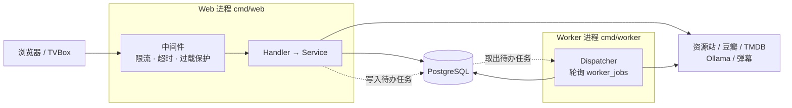

# Moovie 影牛

影视聚合站：统一搜索多个资源站、聚合豆瓣与 TMDB 资料、在线播放、观影记录、弹幕和个性化推荐。

**技术栈**：Go 1.25 · Gin · Go HTML Template · HTMX · PostgreSQL 15+ · Docker Compose

服务端渲染为主，浏览器端只做增强；Web 与后台任务分两个进程运行，避免抓取和计算拖垮用户请求。

## 目录

- [能做什么](#能做什么)
- [快速开始](#快速开始)
- [系统怎么运行](#系统怎么运行)
- [项目结构](#项目结构)
- [配置要点](#配置要点)
- [开发常用命令](#开发常用命令)
- [新手常见问题](#新手常见问题)
- [文档索引](#文档索引)

## 能做什么

- **公开页面**：首页、统一搜索、趋势、发现、影视详情、播放、观看记录、推荐、相似内容、片场、用户公开片单、IPTV 和 TVBox。
- **用户能力**：注册、登录、设置、头像、想看/看过、短评、回复、点赞、播放进度同步和月度观影报告。
- **播放能力**：HLS/M3U8、FLV、MP4、倍速、全屏、画中画、弹幕、手动换源，以及限定在同一集内的自动故障切换。
- **追剧更新**：未完结剧集在详情页和播放页展示下一集播出日期，首页展示在看剧集的今日更新。
- **资料与推荐**：豆瓣资料和短评、TMDB 剧照与季集、外部 ID 映射、向量、相似内容、个性化推荐和热门快照。
- **管理与运维**：资源站与过滤规则管理、媒体匹配复核、版权/分类管理、反馈处理、数据生命周期操作和指标接口。

> 这是代码已提供的能力清单，不代表每一项都已完成生产验收。

## 快速开始

### 方式一：Docker Compose（最省事）

需要一个可访问的 PostgreSQL，以及名为 `postgres_default` 的外部 Docker 网络。

```bash
cp .env.example .env
# 编辑 .env：至少填 DB_HOST / DB_PASSWORD / DB_NAME / APP_SECRET / SITE_URL
docker compose up -d --build
docker compose ps
```

访问 <http://localhost:5008>。

### 方式二：本地 go run（改代码时用这个）

```bash
# 1. 建一个独立数据库（库名不能叫 moovie，会被拒绝启动）
psql -h 127.0.0.1 -U postgres -c 'CREATE DATABASE moovie_new;'

# 2. 配置
cp .env.example .env
# 编辑 .env：DB_* 指向刚建的库，DB_AUTO_MIGRATE=true，JOBS_IN_WEB=true

# 3. 启动（首次会自动建表）
go run ./cmd/web
```

访问 <http://localhost:5008>，另开终端验证：

```bash
curl http://127.0.0.1:5008/health   # 只看进程是否活着
curl http://127.0.0.1:5008/ready    # 会真正查一次数据库
```

**新手最容易踩的坑是 `JOBS_IN_WEB`**：

| 取值 | 含义 | 适用场景 |
| --- | --- | --- |
| `true` | Web 进程内启动后台任务 Dispatcher，单进程搞定 | 本地开发 |
| `false` | Web 不跑后台任务，**必须另外启动 `go run ./cmd/worker`** | Compose、生产 |

填了 `false` 又没起 Worker，页面照样能打开，但豆瓣同步、资料刷新、剧照、向量、热门快照全都不会执行。**不要把"页面能打开"当成 Worker 在跑。**

完整的环境准备、扩展依赖、端口冲突处理见 [开发与发布](docs/开发与发布.md#本地运行)。

## 系统怎么运行



两条关键设计：

1. **用户请求和后台抓取分进程。** Web 只做"尽快返回页面"这一件事；耗时的资料抓取、向量生成、豆瓣同步先写进 `worker_jobs` 表，由 Worker 慢慢做，结果回写数据库。
2. **每类资源都有硬上限。** HTTP 在途请求、重请求、图片代理、数据库连接、外部主机连接都有信号量。超限时主动返回 `503 + X-Moovie-Overload`，而不是让请求无限堆积直到 OOM。

**想改一个页面？按这个顺序找代码：**

```
cmd/web/main.go 找路由
  → internal/<模块>/handler.go   读参数、选响应格式
  → internal/<模块>/service.go   业务规则
  → internal/<模块>/postgres.go  SQL
  → web/templates/pages/...      页面显示
  → web/static/js/app.js         浏览器端增强（如果有）
```

查某个 URL 的入口：

```bash
rg -n 'router\.(GET|POST|PUT|PATCH|DELETE)' internal
```

更完整的架构图、请求时序图、启动阶段和分层原则见 [架构说明](docs/架构说明.md)。

## 项目结构

```text
cmd/
  web/          Web 入口：装配依赖、注册路由、启动和关闭
  worker/       Worker 入口：后台任务 Dispatcher
  dbmigrate/    受控执行数据库 migration
  burstcheck/   压测小工具，验证过载保护
internal/
  platform/     配置、数据库、HTTP 中间件、认证、模板渲染、缓存
  search/       资源站搜索、缓存、熔断
  mediaidentity/ 统一媒体身份、外部 ID、季集、播放候选
  playback/     详情、播放、候选排序、热门快照
  catalog/      豆瓣/TMDB 资料、剧照、向量、发现页
  history/      播放进度与多设备同步
  identity/     用户、登录态、权限
  social/       片场、短评、点赞、回复
  workqueue/    全站唯一的后台任务队列
  admin/        后台管理
  ...           其余模块见架构说明
web/
  templates/    Go HTML 模板
  static/       CSS、JavaScript、图片、PWA
docs/           架构、流程、数据库和运维文档
```

每个模块内部统一是 `handler.go → service.go → store.go → postgres.go` 四层。**每个包的第一个文件顶部都有中文包说明**，想快速了解一个模块先看它：

```bash
head -12 internal/workqueue/dispatcher.go
```

完整目录清单和分层原则见 [架构说明](docs/架构说明.md#目录和分层职责)。

## 配置要点

全部配置项及注释见 [`.env.example`](.env.example)（58 项，每项都有中文说明）。必须自己填的只有这几个：

| 变量 | 说明 |
| --- | --- |
| `DB_HOST` / `DB_PORT` / `DB_USER` / `DB_PASSWORD` / `DB_NAME` | 数据库连接。`DB_NAME=moovie` 会被拒绝，防止误连旧库 |
| `APP_SECRET` | 会话签名密钥，生产要求 ≥32 字节且不能是示例值 |
| `SITE_URL` | 站点绝对地址，用于分享链接和 sitemap；生产必须 HTTPS |
| `JOBS_IN_WEB` | 见上文表格 |
| `DB_AUTO_MIGRATE` | 本地首次设 `true` 自动建表，之后建议改回 `false` |

可选增强（不填就自动降级，不影响基础页面）：`TMDB_API_TOKEN`、`OLLAMA_HOST`、`DANMU_API_BASE`。

分组说明和生产强制校验规则见 [开发与发布](docs/开发与发布.md#配置如何生效)。

## 开发常用命令

```bash
go build ./...
go vet ./...
go test -p 1 ./...
go test -race -p 1 ./...
```

> **`-p 1` 不能省**：各测试包共用同一个数据库，并行跑会互相 TRUNCATE 掉数据。本地同时开着 `go run ./cmd/web` 也会干扰测试。

数据库结构变更：在 `internal/platform/database/migrations/` 追加新编号的 SQL 文件，**不要改已有文件**（已执行过的版本不会重跑）。

## 新手常见问题

<details>
<summary><b>改了代码，页面为什么没变化？</b></summary>

按顺序检查：

1. 浏览器访问的端口是不是当前 `go run` 的端口。
2. 是否还有旧的后台进程监听同一端口（`lsof -nP -iTCP:5008 -sTCP:LISTEN`）。
3. 改的是完整页面还是 HTMX partial。
4. `WEB_ROOT` 是否指向当前仓库的 `web/`。
5. 浏览器是否缓存了 `/static/` 资源，开发时强制刷新。
6. 模板加载错误通常在启动时就会打印，别忽略终端日志。
</details>

<details>
<summary><b><code>/health</code> 正常但 <code>/ready</code> 返回 503？</b></summary>

进程活着，但数据库连接或查询没在两秒内成功。检查 PostgreSQL 是否启动、`.env` 里的主机/端口/密码/库名、连接池是否耗尽、数据库是否被慢查询占满。

注意：`/ready` 失败**不应该**触发容器重启，那只会让情况更糟。
</details>

<details>
<summary><b>搜索页能打开但没有结果？</b></summary>

先区分"本地结果为空"和"上游请求失败"。检查资源站是否启用、来源健康状态、超时日志和熔断冷却。单个来源失败不代表整个搜索模块坏了——降级策略就是这么设计的。
</details>

<details>
<summary><b>压力一大就看到 503，是 bug 吗？</b></summary>

不是，是主动保护。看响应头 `X-Moovie-Overload` 判断是全局、重请求还是图片槽位满了。受控 503 比请求无限堆积后容器 OOM 更容易恢复。详见 [并发与容量](docs/并发与容量.md)。
</details>

<details>
<summary><b>没启动 Worker，网站还能用吗？</b></summary>

基础页面和只读请求可以正常使用，但豆瓣同步、资料、短评、剧照、向量和热门快照不会被执行。去数据库看 `worker_jobs` 的状态，不要把"任务待处理"误判成 Web 请求失败。
</details>

<details>
<summary><b>为什么有 <code>/play</code> 和 <code>/watch</code> 两个播放入口？</b></summary>

分工不同，不能合并：`/play/:source_key/:vod_id` 直接播某个资源站的资源，不需要豆瓣关联；`/watch/:douban_id` 先确定媒体身份再跨站挑最优线路。详见 [业务流程](docs/业务流程.md#播放流程)。
</details>

## 文档索引

| 文档 | 内容 |
| --- | --- |
| [架构说明](docs/架构说明.md) | 名词表、架构图、请求时序、启动阶段、目录分层、代码阅读顺序 |
| [业务流程](docs/业务流程.md) | 搜索、播放、观看历史、追剧更新、资料与推荐五条链路 |
| [数据库表结构说明](docs/数据库表结构说明.md) | 30 张表的分层设计、字段含义和核心数据流 |
| [并发与容量](docs/并发与容量.md) | 过载保护机制、默认边界、容器资源、压测基线 |
| [开发与发布](docs/开发与发布.md) | 本地环境、配置详解、migration、测试门禁、Compose、上线回滚 |
| [高并发运维手册](docs/HIGH_CONCURRENCY_RUNBOOK.md) | 生产重启诊断、容量评估和处置流程 |

专题设计文档：

- [M3U8 广告指纹众包跳过](docs/M3U8广告指纹众包跳过功能交接文档.md)
- [同步豆瓣个人观影记录的方案](docs/同步豆瓣个人观影记录的方案.md)
- [根据豆瓣 ID 获取 TMDB 信息](docs/根据豆瓣ID获取tmdb电影信息.md)
- [豆瓣热门电影手机 API](docs/豆瓣热门电影手机api.md)
