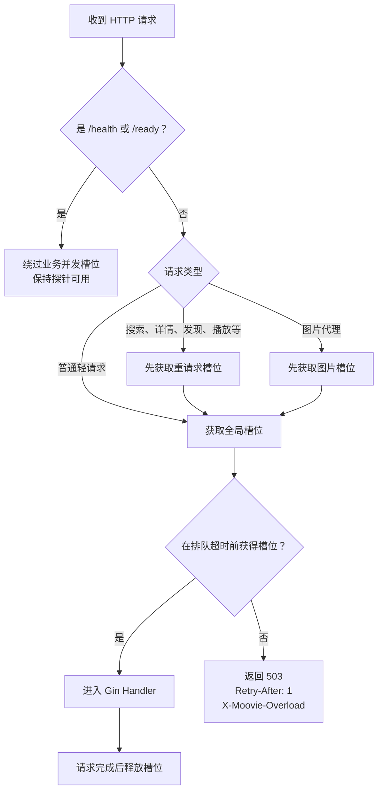

# 并发保护与容量边界

这份文档说明"为什么高峰期会返回 503，以及那是设计而不是故障"。生产故障处置流程见 [高并发运维手册](HIGH_CONCURRENCY_RUNBOOK.md)。

## 请求是怎么被放行或拒绝的

每个 Web 实例不是无限接收请求，而是先分类再获取信号量槽位：



**为什么先拿"重请求槽位"再拿"全局槽位"**：如果顺序相反，大量重请求可能先占满全部全局槽位，然后一起等待较小的重请求池，连普通登录页或简单页面也会被拖住。

## 默认边界

单个 Web 实例：

| 资源 | 默认值 | 超过后会怎样 |
| --- | ---: | --- |
| HTTP 总在途请求 | 64 | 短暂排队，随后返回 503 |
| 重请求 | 12 | 只限制搜索、详情、发现、播放等高成本路径 |
| 图片代理 | 24 | 防止大量图片下载占满所有请求 |
| 过载排队 | 100ms | 到期主动降载，不让 goroutine 无限堆积 |
| TCP 连接 | 512 | Listener 不再接收更多连接 |
| Web / Worker PostgreSQL 连接 | 12 / 6 | pgx 池内等待，不无限创建连接 |
| 单个外部主机连接 | 12 | 复用共享 Client，限制套接字数量 |
| 单次搜索来源并发 | 6 | 其余来源等待或受总超时取消 |
| 搜索后台补全并发 | 8 | 无槽位时放弃可重试的非关键异步工作 |
| 搜索缓存 | 500 条 | 按 LRU 淘汰（`internal/platform/cache`，搜索、弹幕、相似推荐共用一份实现） |
| 个性化推荐快照 | 每用户 1 行 / 6 小时 | Web 只读快照；缺失或过期时由 Worker 去重刷新 |
| AppleCMS 单响应 | 4MiB | 超限响应被拒绝 |
| 生产成功访问日志 | 10%，最多 20 条/秒 | 错误和慢请求仍然记录 |

对应的可调变量见 `.env.example` 中的 `HTTP_MAX_*`、`SEARCH_*`、`OUTBOUND_MAX_CONNS_PER_HOST`、`DB_MAX_CONNS`。生产环境这些值不能超过代码里的安全上限，超了会在监听端口前直接退出。

## 容器资源边界

`docker-compose.yml` 的默认值：

- **Web**：1GiB 内存、`GOMEMLIMIT=700MiB`、2 CPU、12 条数据库连接。
- **Worker**：512MiB 内存、`GOMEMLIMIT=320MiB`、1 CPU、6 条数据库连接。
- 两个容器均限制 PID 和日志大小，并使用只读根文件系统。
- Web liveness 使用 `/health`（不碰数据库），`/ready` 只供负载均衡判断是否接流量。

> **`/ready` 失败不应触发容器重启。** 数据库短暂拥塞时 `/ready` 会失败，但进程本身仍然健康，重启只会让情况更糟。

## 本地压测基线

本地最终容量样本：热点详情页 20,000 请求、200 并发，传输错误 0、健康检查失败 0、P95 约 129ms；RSS 约 64MiB → 148MiB，并在停止负载后保持稳定。

2026-08-12 在最终迁移库上复验详情页 5,000 请求和规范播放页 3,000 请求，均为 200 并发、传输错误 0、健康检查失败 0、P95 分别约 127ms 和 134ms，过载请求按设计返回受控 503。

> 该数据只证明保护机制和本机基线，**不是生产 SLA**。

复现方式：

```bash
go run ./cmd/burstcheck -h
```

## 持续 503 时怎么办

1. 先看响应头 `X-Moovie-Overload`，判断是全局、重请求还是图片槽位满了。
2. 再看服务日志确认是不是某个上游拖慢了重请求。
3. 然后考虑增加 Web 副本、边缘限流或缓存。

**不要第一时间把所有并发和数据库连接数调大**，那只是把压力推给 PostgreSQL 或外部服务。受控 503 比请求无限堆积后容器 OOM 更容易恢复。

详细诊断步骤见 [高并发运维手册](HIGH_CONCURRENCY_RUNBOOK.md)。
