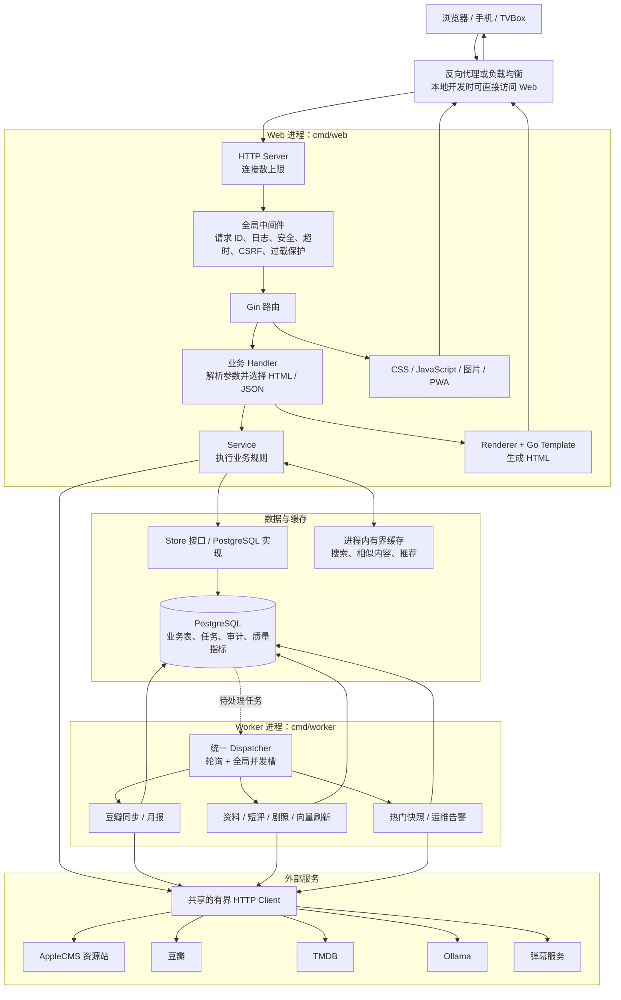
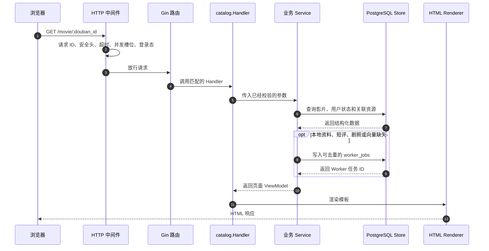

# 架构说明

这份文档回答"系统是怎么组织起来的"。第一次接触本项目、Go Web 或分层架构的开发者建议先读这里，再动手改代码。

- 想知道某个功能的具体步骤 → [业务流程](业务流程.md)
- 想知道数据存在哪张表 → [数据库表结构说明](数据库表结构说明.md)
- 想知道怎么跑起来、怎么发布 → [开发与发布](开发与发布.md)

## 目录

- [先理解这个系统解决什么问题](#先理解这个系统解决什么问题)
- [需要先认识的名词](#需要先认识的名词)
- [整个系统如何运行](#整个系统如何运行)
- [一次普通页面请求会经过什么](#一次普通页面请求会经过什么)
- [后台任务为什么要单独运行](#后台任务为什么要单独运行)
- [Web 进程的启动顺序](#web-进程的启动顺序)
- [目录和分层职责](#目录和分层职责)
- [推荐的代码阅读顺序](#推荐的代码阅读顺序)
- [代码注释约定](#代码注释约定)

## 先理解这个系统解决什么问题

Moovie 需要同时处理四类工作：

1. 接收浏览器或 TVBox 的请求，返回 HTML、JSON 或静态文件。
2. 从 PostgreSQL 读取用户、影视、资源、播放候选和任务数据。
3. 访问 AppleCMS、豆瓣、TMDB、Ollama、弹幕接口等外部服务。
4. 在后台执行同步、向量生成、热门快照和运维检查。

旧式实现容易把这些工作全部塞进一个 Web 进程。一旦大量用户同时进入，Web 请求、外部抓取和后台任务就会争抢 CPU、内存、网络连接和数据库连接，最终可能触发 OOM 或健康检查失败，导致容器反复重启。

当前架构的核心取舍：

- **Web 和 Worker 分离**，用户请求不再与大部分后台任务运行在同一进程。
- **每类资源都有明确上限**：HTTP 在途请求、重请求、图片代理、数据库连接和外部主机连接，详见 [并发与容量](并发与容量.md)。
- **媒体身份、资源站记录和播放候选分开保存**，换源时不会把不同影片或不同剧集混在一起。
- **目录、片单和播放进度各有唯一运行时数据源**（`media`、`user_movies`、`playback_positions`），不保留双读双写和废弃表。

## 需要先认识的名词

| 名词 | 在本项目中的含义 | 可以先看哪里 |
| --- | --- | --- |
| Route（路由） | URL 和处理函数的对应关系，例如 `GET /movie/:id` | 各模块 `handler.go` 中的 `Register` |
| Handler（处理器） | 读取 HTTP 参数、调用业务逻辑、选择 HTML 或 JSON 响应 | `internal/*/handler.go` |
| Service（服务） | 执行业务规则，不负责页面排版 | `internal/*/service.go` |
| Store（存储接口） | 业务层需要的数据库能力约定 | `internal/*/store.go`、`ports.go` |
| Postgres Store | Store 的 PostgreSQL 实现 | `internal/*/postgres.go` |
| Renderer（渲染器） | 把 Go 数据交给模板，生成最终 HTML | `internal/platform/web`、`web/templates` |
| Middleware（中间件） | 在 Handler 前后统一处理日志、安全、超时、过载和登录态 | `internal/platform/httpserver` |
| Migration | 按版本顺序修改数据库结构的 SQL 文件 | `internal/platform/database/migrations` |
| Worker | 不直接服务网页，专门执行后台任务的进程 | `cmd/worker` |
| Feature Flag | 控制少数高风险策略是否启用，例如资源匹配自动确认 | `.env.example` |

还有六个容易混淆的数据概念，理解它们等于理解了半个系统：

- `media`：一部电影或剧集的**统一身份**，例如"同一部影片"。
- `media_units`：作品的正片、单集或单期；保留官方播出日期 `air_date`，资源仅补充缺失单元并重算 `has_resource`。
- `vod_items`：**某个资源站**提供的一条资源记录，同一部影片可以对应多条。
- 运行时播放候选：从 `vod_items.vod_play_url` 统一解析，按单元、版本和分段选源，不再持久化候选索引。
- `user_movies`：用户的想看、在看、看过和评分等**片单状态**。
- `playback_positions`：唯一的服务端**播放进度**表。

## 整个系统如何运行

实线表示一次请求中的直接调用，虚线表示通过数据库或任务队列进行的异步协作。



## 一次普通页面请求会经过什么

以用户打开影视详情页为例：



**排查一个页面时，按同样的顺序找代码：**

1. 在模块的 `handler.go` 找到路由。
2. 看 Handler 读取了哪些路径参数、查询参数或表单字段。
3. 找到它调用的 Service 或 Store 方法。
4. 看 `postgres.go` 中的 SQL，确认数据从哪里来。
5. 看 `web/templates` 中对应页面或 partial，确认数据如何显示。
6. 如果页面还调用了接口，再检查 `web/static/js/app.js` 或 `player.js`。

查 URL 入口的常用命令：

```bash
rg -n 'router\.(GET|POST|PUT|PATCH|DELETE)' internal
rg -n '要查找的路径或字段名' cmd internal web
```

## 后台任务为什么要单独运行

Web 只负责尽快完成用户请求。影视资料、豆瓣短评、TMDB 剧照、向量等耗时或需要访问多个外部服务的工作，先写入 PostgreSQL，再由 Worker 执行：

1. Web 收到豆瓣同步、资料刷新等请求。
2. Handler/Service 在数据库中创建或更新任务，马上返回任务状态。
3. Worker 定时扫描待处理任务。
4. Worker 调用豆瓣、TMDB 或 Ollama。
5. Worker 把结果、错误和更新时间写回 PostgreSQL。
6. 浏览器刷新或轮询状态时，从数据库读取最终结果。

全站只有一张任务表 `worker_jobs`。管理员可在 `/admin/jobs` 查看队列并按状态筛选，列表使用任务 ID 游标分页，每页 50 条。运维任务每天分批清理终态记录：已完成保留 30 天、失败保留 90 天，每轮最多删除 1,000 条；等待中和执行中的任务永不清理。

> 生产 Compose 强制 Web 使用 `JOBS_IN_WEB=false`。不要为了"让任务马上跑"而临时让每个 Web 副本都启动 Dispatcher，否则扩容后同一类后台工作会与用户请求争抢资源。

## Web 进程的启动顺序

入口是 `cmd/web/main.go`，代码按 `── 阶段 N ──` 注释分段：

0. 解析 `.env`，再读取和校验完整配置。任一步失败都直接退出。
1. **模板**：编译所有 HTML 模板，缺模板直接报错退出。
2. **数据库连接 + Store 创建**：连接 PostgreSQL，按需执行 migration，用同一个连接池创建所有业务 Store。
3. **进程级共享组件**：创建全局共享的外部 HTTP Client（资源站用、AI 用各一个）、搜索并发控制器、资源站熔断器和采集器。
4. **Service 层**：创建豆瓣/TMDB 数据提供者、搜索服务、播放详情、热门榜、元数据刷新链（豆瓣 → 短评 → 剧照 → 向量）等。
5. **内嵌后台任务**（可选）：`JOBS_IN_WEB=true` 时在 Web 进程内启动 Dispatcher，本地开发省得起两个进程。
6. **Handler 层**：创建各模块的 HTTP 处理器。代码中大量 `if xxx, ok := store.(SomeInterface)` 是在检查 Store 是否实现了某个可选能力——实现了就注入，没实现就安全降级。
7. **路由注册 + HTTP 服务启动**：集中注册所有路由，安装全局中间件，启动监听。
8. **等待退出信号**：主 goroutine 阻塞等 `SIGINT`/`SIGTERM`。
9. **优雅关闭**：按顺序关闭 HTTP 服务 → 后台搜索 → 熔断器 → Worker → 数据库 → HTTP Client，所有步骤共用同一个超时窗口，防止某一步卡住导致进程挂起。

## 目录和分层职责

```text
cmd/
  web/              Web 入口：装配依赖、注册路由、启动和关闭服务
  worker/           Worker 入口：启动统一任务 Dispatcher
  dbmigrate/        受控执行数据库结构 migration，可停在指定版本
  burstcheck/       突发请求、受控 503 和健康隔离检查
internal/
  platform/         配置、数据库、HTTP、认证、出站访问、模板渲染、进程内缓存、按 IP 限流
  content/          首页、静态页面、robots、ads.txt 和 sitemap
  search/           资源站搜索、缓存、熔断、统一搜索和资源治理
  mediaidentity/    统一媒体身份、外部 ID、季集、播放候选和剧集播出日期
  mediatitle/       影视标题和资源标题规范化
  playback/         详情、播放、候选排序、质量事件和热门快照
  playurl/          播放地址和格式解析
  catalog/          豆瓣/TMDB 资料、剧集、剧照、向量和发现页
  recommendation/   相似内容和个性化推荐
  identity/         用户身份、登录态和权限
  history/          唯一播放进度模型、幂等同步、游标和首页今日更新
  library/          想看、看过和用户影视状态
  douban/           豆瓣绑定、同步任务及其处理器
  doubanpopular/    豆瓣热门数据 Provider
  report/           月度观影报告和公开报告页
  social/           片场、短评、点赞和回复
  feedback/         用户反馈
  danmaku/          弹幕读取和发送
  admin/            后台管理页面、匹配复核和数据操作
  workqueue/        全站唯一的后台任务队列（worker_jobs）：入队、抢锁、租约、重试退避
  operations/       指标和运维检查
  compat/           页面 SEO 快照抓取与端点压测的共享实现，供测试和 burstcheck 使用
  contract/         最终路由和请求输入契约，防止废弃 API 回流
web/
  templates/        Go HTML 模板
  static/css/       全站样式
  static/js/        业务 JavaScript 与第三方浏览器库
scripts/release/    发布源码完整性审计脚本
docs/               架构、流程、数据库和运维文档
```

分层原则：

- Handler 处理 HTTP，不把复杂 SQL 或匹配算法直接写在 Handler 中。
- Service 负责业务规则，通过小型接口依赖 Store 或外部 Provider。
- Store 负责持久化，不负责决定页面显示文案。
- `cmd/web` 和 `cmd/worker` 是依赖装配层，可以知道所有业务模块；业务模块之间尽量只通过接口协作。
- 模板只负责显示已经准备好的 ViewModel，不在模板中重新实现业务判断。

公开页面路径会尽量保持不变，以保护用户书签和 SEO。浏览器页面只调用最终 API，`internal/contract` 同时守住"应存在的正式路由"和"必须保持 404 的废弃路由"。

## 推荐的代码阅读顺序

第一次阅读不要从最大的 SQL 文件或所有 Handler 开始：

0. 先看目标包顶部的中文包说明（例如 `head -12 internal/search/service.go`），一句话知道它管什么、碰哪几张表。
1. [README](../README.md)：系统边界和快速开始。
2. `.env.example`：知道系统有哪些可选能力和安全上限。
3. `cmd/web/main.go`：看所有模块如何被组装。
4. `internal/platform/httpserver/server.go`：看一条请求先经过哪些保护。
5. 选一个业务模块，例如 `internal/search`，按 `handler.go → service.go → store.go → postgres.go` 读。
6. `web/templates/layouts/base.html` 和一个具体页面模板：理解 SSR 页面结构。
7. `web/static/js/app.js`、`player.js`：理解浏览器端增强和播放器行为。
8. `cmd/worker/main.go`：理解后台任务如何与 Web 分离。
9. `internal/platform/database/migrations`：最后再看数据库结构如何逐步演进。

## 代码注释约定

非测试 Go 文件均已补齐中文注释，可以直接当阅读材料：

- **每个包的第一个文件顶部有一段包说明**，写清这个包干什么、涉及哪几张表、核心流程是什么：

```bash
head -12 internal/workqueue/dispatcher.go     # 后台任务队列怎么运转
head -12 internal/history/model.go            # 观看进度和多设备同步
head -12 internal/social/model.go             # 为什么短评没有独立的表
```

- **每个导出的类型、函数和常量都有一行说明**，说的是"它负责什么"，不是重复代码字面意思。
- **标了 `ponytail:` 的注释是已知的简化取舍**，写明了当前实现的天花板和以后该怎么升级，是优化时优先要看的地方：

```bash
rg -n 'ponytail:' internal
```

必要注释使用中文，重点解释：为什么这样设计；并发上限、超时、幂等、事务和回滚边界；数据来源优先级、媒体匹配和同集换源规则；功能开关的开启顺序和误开风险。

Go 导出类型或函数的注释仍以标识符开头（例如 `// Config 保存……`），便于 Go 文档工具识别。`htmx.min.js`、`hls.min.js` 等第三方压缩文件保持原样。
